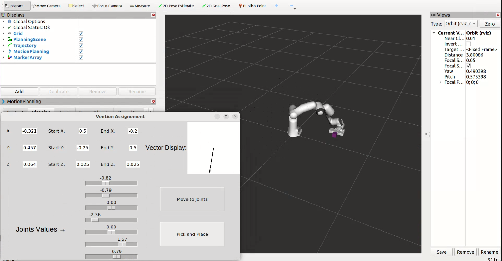

# Vention Assignement: Pick and Place GUI

A pick and place task using a panda robot with a GUI to start, choose initial joints and display cube position and up vector.

## Prerequisites
Developed and tested in an Ubuntu 22.04 environment.
To be able to run the demo:
- Install [ros-humble](https://docs.ros.org/en/humble/Installation.html) package on your machine.
- Create a ros2 [workspace](https://docs.ros.org/en/humble/Tutorials/Beginner-Client-Libraries/Creating-A-Workspace/Creating-A-Workspace.html).
- Download this repo in the /src directory of the ros2 workspace.

## Run instructions
- Build the workspace with `colcon build --mixin release --parallel-workers 1`
- Run the demo with `ros2 launch moveit2_tutorials vention_demo.launch.py`. This will:
    - Launch **move_group.launch.py**.
    - Run **mtc_tutorial** node.
    - Launch **move_group_interface_tutorial.launch.py**.
    - Run **monitor** node.

## Usage
Users can interact with the rviz simulation by changing joints sliders and clicking on *Move to joints* button. They can also click on *Pick and Place* button to start the pick and place operation. A cube will appear and it will be moved to the drop zone. Users can follow its position and up vector in the GUI that is updated at 500ms.

## Explanations

The **move_group.launch.py** does the same as in the moveit [demo](https://moveit.picknik.ai/humble/doc/examples/move_group_interface/move_group_interface_tutorial.html): launch rviz, loads robot description and controllers.

The **mtc_tutorial** is a modified version of the moveit pick and place [demo](https://moveit.picknik.ai/humble/doc/tutorials/pick_and_place_with_moveit_task_constructor/pick_and_place_with_moveit_task_constructor.html). The *moveit2_tutorials/doc/tutorials/pick_and_place_with_moveit_task_constructor/src/mtc_node.cpp* has been modified to publish the hardcoded pick position and drop position of the cube over the topics `mtc_node/start_position` and `mtc_node/end_position`. Also it runs the `mtc_node/start_pick_and_place` service to know when to start the pick and place operation.

The **move_group_interface_tutorial.launch.py** is a node than uses moveit to plan and execute joint commands. Specifically, the `moveit2_tutorials/doc/examples/move_group_interface/src/move_group_interface_tutorial.cpp` will subscribe to `/desired_joint_states` topic and use the function `moveit::planning_interface::MoveGroupInterface::setJointValueTarget`.

Finally, most of the logic is located in monitor node written in python, *src/monitor/monitor/monitor.py*. It uses python `tkinter` library to launch a GUI in a thread. The main thread contains the ros node that subscribes to `/monitored_planning_scene` to have the cube pose that is thereafter displayed in the GUI at 500ms. It also subscribes to `mtc_node/start_position` and `mtc_node/end_position` topics in order to display the cube start and end position in the GUI. In addition, it can publish the selected joint positions in the GUI to the `/desired_joint_states` topic so moveit can plan and execute a joint position. Finally, there is a service client to the `/mtc_node/start_pick_and_place` service. When the pick and place button is pressed the client sends a messages that is received by the server so the pick and place operation can begin.

